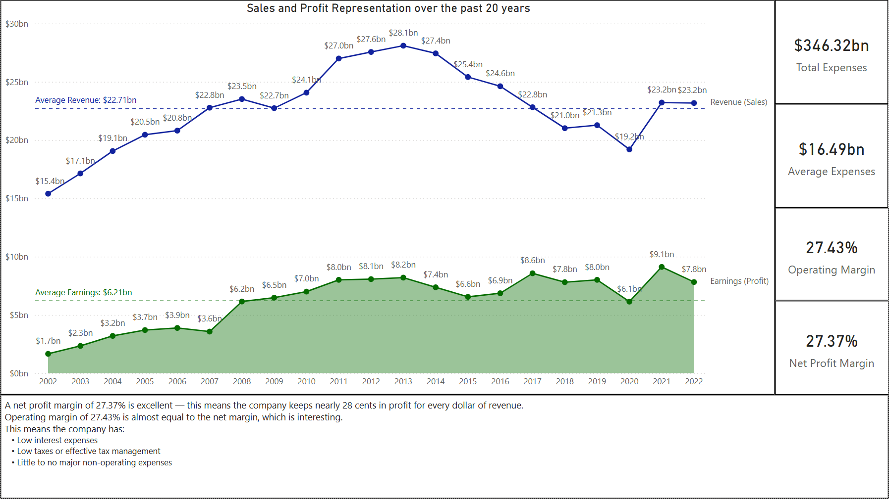

# McDonalds - Financial Analysis of past 20 years
## A brief analysis using publicly available dataset about Mc Donalds

### Information
    - Dataset - [https://www.kaggle.com/code/srilalithagarapati/mcdonald-financial-statement-analysis]
    - Dataset format - Microsoft Excel
    - Tools used - Microsoft Excel and Power BI

### Analysis needed
    - Understanding current situation using indicators usually used in fundamental analysis
    - How is the profit trend (Gross and Net) over the years in comparison to revenue
    - Is the company able to effectively operate business by keeping operating costs low
    - How is investor sentiment when investing in the company
    - How is the company able to pay off debt over time
    
### Data Cleaning
    - While the data was simple excel table with metrics for past 20 years. It did require cleaning and formatting
    - Most of the figures were in billion dollars, so converted them to ensure data consistency and no errors during creating measures.
    - Standardized ratios to % to ensure better understanding during analyzing
    - Created a date column since the only column related to date was year
    - Converted it into a table for better connection to Power BI
    
### Process
    -Measures created
    -Average Expenses = Average of Total Expenses
    -Total Expenses = Revenue - Earnings
    -Debt Ratio = Total Liabilities/ Total Assets
    -Net Profit Margin = Earnings/ Revenue
    -Operating Margin = Operating Income / Revenue
    
### Visualizations Created
    - Sales vs Profit - This visual explains the trend of Revenue and Earnings. It also has some key measure developed from the base available data such as Total Expenses, Average Expenses, Operating 
                        Margin and Net Profit Margin.
    - Net Asset trend due to increasing liabilities - This is a line chart of Total Liabilities, Total Assets and Net Assets. It shows the corelation between them.
    - P/E vs P/S - A line chart showing the investor’s alignment in investing towards revenue and earnings.
    - Earnings vs Debt - There are couple of charts here. It shows how much money each year is generated in profits vs how much is remaining in debt. Another chart shows the operating margin which 
                          shows that operating margin is improving every year in small increments.
                          
### Insights
    - A net profit margin of 27.37% is excellent — this means the company keeps nearly 28 cents in profit for every dollar of revenue.
    - Operating margin of 27.43% is almost equal to the net margin, which is interesting.
        - This means the company has:
            - Low interest expenses
            - Low taxes or effective tax management
            - Little to no major non-operating expenses
    - There is negative trend for net assets after 2014. The possible cause for that may be significant increase in Total Liabilities which seems debt is not paid off in proportion to borrowings. Also 
      considering total assets are increasing which mostly comes from borrowing, the combined effect is shown in net asset's negative growth.
    - There is a clear difference in investor sentiment on how much confidence they have in sales vs profit. While sales have been steady, the company's good maintenance of operating cost and 
      profitability allows investors to thing that profitability will keep increasing hence betting more on growth of profit, year on year.
    - Even with company keeping a healthy profit from every dollar of sale it makes, it is still not increasing the proportion towards paying off the debt or it is taking more debt compared to the net earnings
    - 79% of the company assets are financed through debt
    
### Brief Visuals
Some sample visuals from the analysis. Please refer to the pdf file attached for full picture

